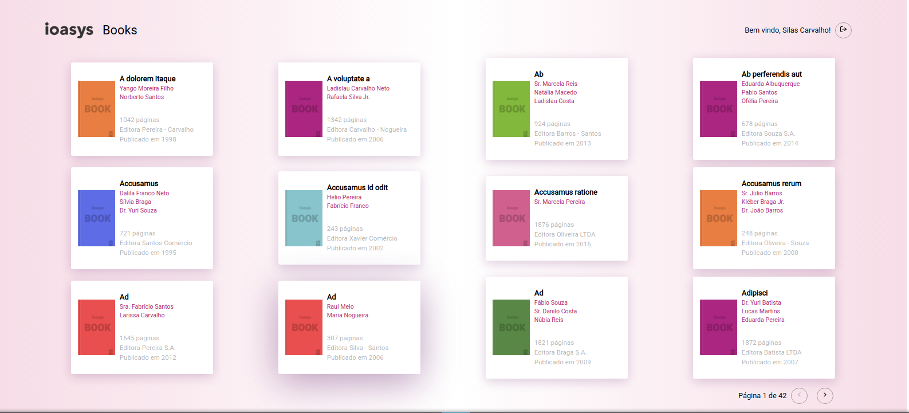
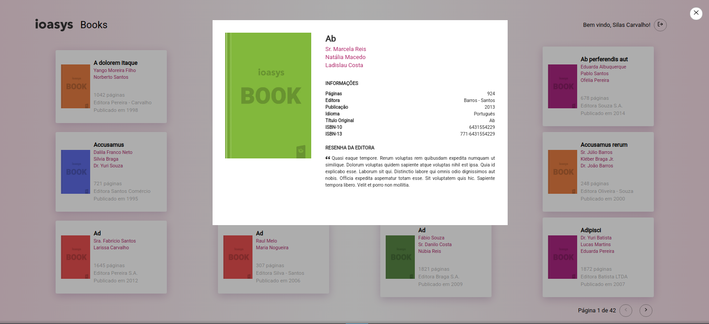

<h1 align="center">
    
  Ioasys Books
   
</h4>

</h1>

## Sobre o projeto
**Processo seletivo  [Ioasys][ioasys]** 
Ioasys Book - Visualização em lista e detalhada de seus livros! 

- Login
- Logout
- Lista de livros com paginação
- Ver os detalhes de um livro


## Layout
<p align="center" style="display: flex; align-items: flex-start; justify-content: center;">
   <br>

  
  
</p>

## Tecnologias

- [ReactJS][react]
- [React Router Dom][reactrouter]
- [React Loading][reactloading]
- [React Icons][reacticons]
- [Axios][axios]
- [Styled Components][styledcomp]


## Como executar o projeto

### Pré-requisitos

Antes de começar, você vai precisar ter instalado em sua máquina as seguintes ferramentas:
[Git](https://git-scm.com), [Node.js][nodejs], [Yarn][yarn]
Além disto é bom ter um editor para trabalhar com o código como [VSCode][vscode] 
### Usuário para Teste
- Email: desafio@ioasys.com.br
- Senha: 12341234
### Executando

```bash
# Clone este repositório
$ git clone https://github.com/rafaelabc/ioasys-books

# Acesse a pasta do projeto no terminal/cmd
$ cd ioasys-books

# Instale as dependências
$ yarn install

# Inicie a aplicação
$ yarn start

# A aplicação será aberta na porta:3000 - acesse http://localhost:3000
```
Rota para acessar website
* /localhost:3000

Feito por Rafaela Custódio [Entre em contato!](https://www.linkedin.com/in/rafaela-custodio/)

[yarn]: https://yarnpkg.com/
[vscode]: https://code.visualstudio.com/
[license]: https://opensource.org/licenses/MIT
[reacticons]: https://react-icons.github.io/react-icons/
[ioasys]: https://ioasys.com.br/
[reactloading]: https://github.com/fakiolinho/react-loading
[reactrouter]: https://reactrouter.com/web/guides/quick-start
[react]: https://pt-br.reactjs.org/
[styledcomp]: https://styled-components.com/
[axios]: https://github.com/axios/axios
[nodejs]: https://nodejs.org/en/